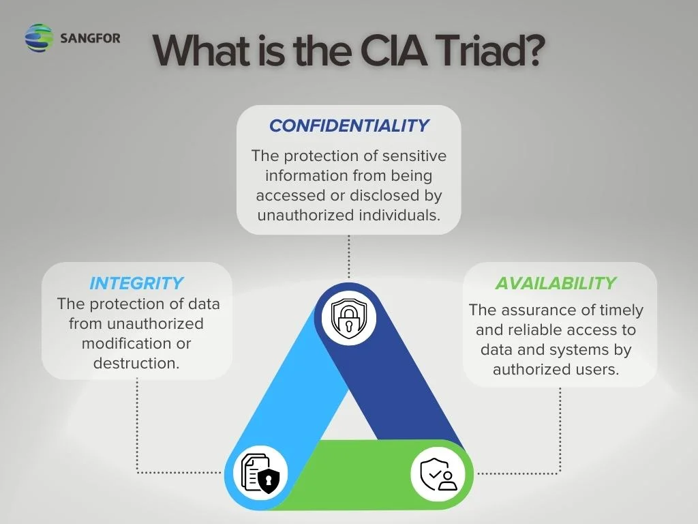
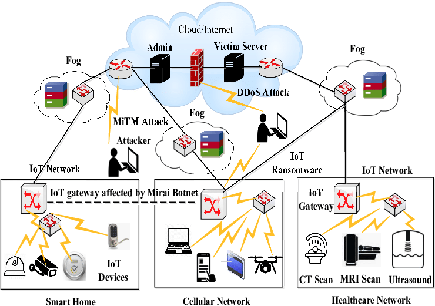

# Core Security Principles

> Outline:

- [ ] **Providing a Secure System**
- [ ] **Keeping Information Safe**
- [ ] **Managing Risk**
- [ ] **Analyzing Risk**
- [ ] **Avoiding Scam Artists**
- [ ] **Recognizing the Internet of Things (IoT)**

---

## Content

### Providing a Secure System 🛡️

- **Objective**: Safeguard sensitive information by ensuring its confidentiality, integrity, and availability.

> **CIA Triad** 🔺

- **Confidentiality (السرية)**: Ensuring that information is accessible only to those authorized to access it. 🗝️
- **Integrity (النزاهة)**: Ensuring that information remains accurate and unaltered by unauthorized entities. ✅
- **Availability (التوافر)**: Ensuring that information and resources are accessible when needed by authorized users. 🌐

- **What is DDoS?** (الهجوم الموزع على الخدمة): A cyberattack that uses multiple systems to overwhelm a target with excessive traffic, leading to service disruption. 🚫

### Keeping Information Safe 🔒

- **Methods to Ensure Confidentiality**:

  - **Passwords or PINs**: Utilize strong, unique credentials. 🔑
  - **Smart Cards**: Use physical cards with embedded security features. 🏷️
  - **Biometric Authentication**: Implement fingerprint or other biometric authentication methods. 🖐️

- **Methods to Ensure Integrity**:

  - **Specialized Monitoring Software**: Employ tools to detect and alert on unauthorized changes and suspicious activity. 🛠️

- **Usage of Permissions**:

  - **Access Control**: Assign appropriate permissions to users and groups to control access to resources. 👥

- **Usage of Encryption**:

  - **Data Protection**: Encrypt sensitive data to protect it from unauthorized access. 🔐

- **Methods to Ensure Availability**:
  - **System Updates**: Regularly apply patches and updates to keep systems secure. 🔄
  - **Data Backup**: Store backups in off-site locations and regularly update them. 💾
  - **Personal Data Backup**: Ensure personal data is also backed up regularly. 📂

### Managing Risk ⚠️

- **What is Risk?** (الخطر):

  - The potential for harm or loss resulting from exposure to threats. It involves protecting both tangible and intangible assets. 🏛️

- **Tangible vs. Intangible Assets**:
  - **Tangible Assets** (المادية): Physical items like hardware and infrastructure. 🖥️
  - **Intangible Assets** (غير المادية): Non-physical items like intellectual property and data. 📊

> **Risk = Threats × Vulnerabilities** ⚖️

- **What is a Threat?** (التهديد):

  - Any potential danger that can exploit a vulnerability to cause damage or loss. It can be intentional or accidental. 🚨

- **What is a Vulnerability?** (الثغرة):
  - A security weakness that can be exploited by threats to gain unauthorized access or cause damage. For example, an unpatched software vulnerability. 🔍

### Analyzing Risk 🧠

- **What is Risk Analysis?** (تحليل المخاطر):

  - The process of identifying potential threats and evaluating system weaknesses to mitigate risk. 🔎

- **How to Reduce Overall Risk**:
  - **Address Vulnerabilities**: Fix identified vulnerabilities to minimize risk exposure. 🛠️
  - **Regular Testing**: Continuously test systems and address vulnerabilities proactively. 🔄

### Avoiding Scam Artists 🕵️

- **What is Social Engineering?** (الهندسة الاجتماعية):

  - A manipulation technique used by cybercriminals to deceive individuals into divulging confidential information. 🎭

- **Dangerous Tactics**:

  - **Persuasion-Based Attacks**: Techniques that do not require technical skills but rely on convincing individuals to reveal sensitive information. 🤔

- **Methods Used in Social Engineering**:

  - **Phishing**: Deceptive emails designed to steal information. 📧
  - **Vishing** (Voice Phishing): Fraudulent phone calls to gather sensitive data. 📞
  - **Instant Messaging (IM)**: Use of chat services to deceive users. 💬
  - **SMS (Short Message Service)**: Text messages used for scamming. 📲
  - **Scareware**: Fake security alerts designed to scare users into taking harmful actions. 🚨

- **Best Practices to Avoid Social Engineering**:
  - Be cautious of individuals asking for excessive personal information. 👁️
  - Verify the identity of unknown contacts before sharing sensitive details. 🕵️‍♂️
  - Exercise caution when entering credit card information online. 💳
  - Disable unnecessary push notifications to avoid distractions. 📵

> More

### Recognizing the Internet of Things (IoT) 🌐

- **What is The Internet of Things (IoT)?** (إنترنت الأشياء):

  - A network of interconnected devices that collect and share data through nodes and controllers. 📡

- **Reducing IoT Device Risks**:
  - **Manufacturer Responsibilities**:
    - Ensure regular security updates are provided. 🔄
    - Enable password protection for devices. 🔐
    - Have a dedicated team for vulnerability reporting and resolution. 🏢
    - Address weaknesses promptly. 🛠️

> More

