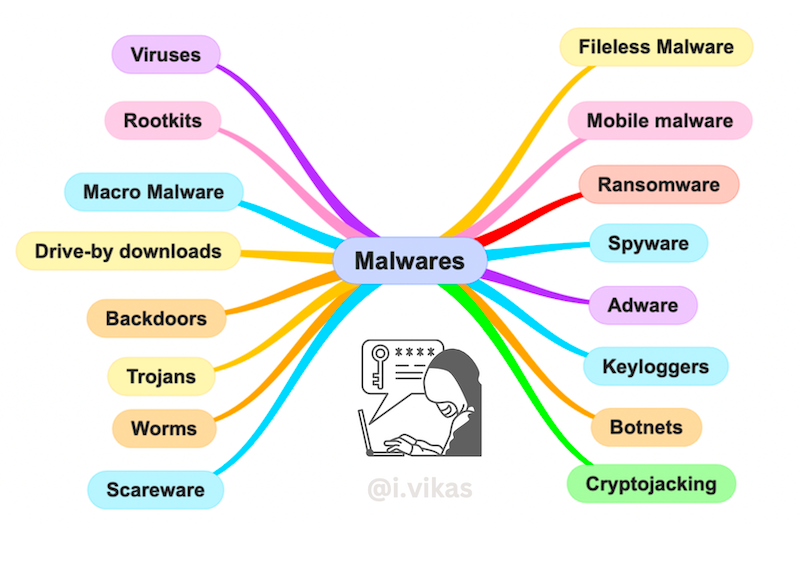
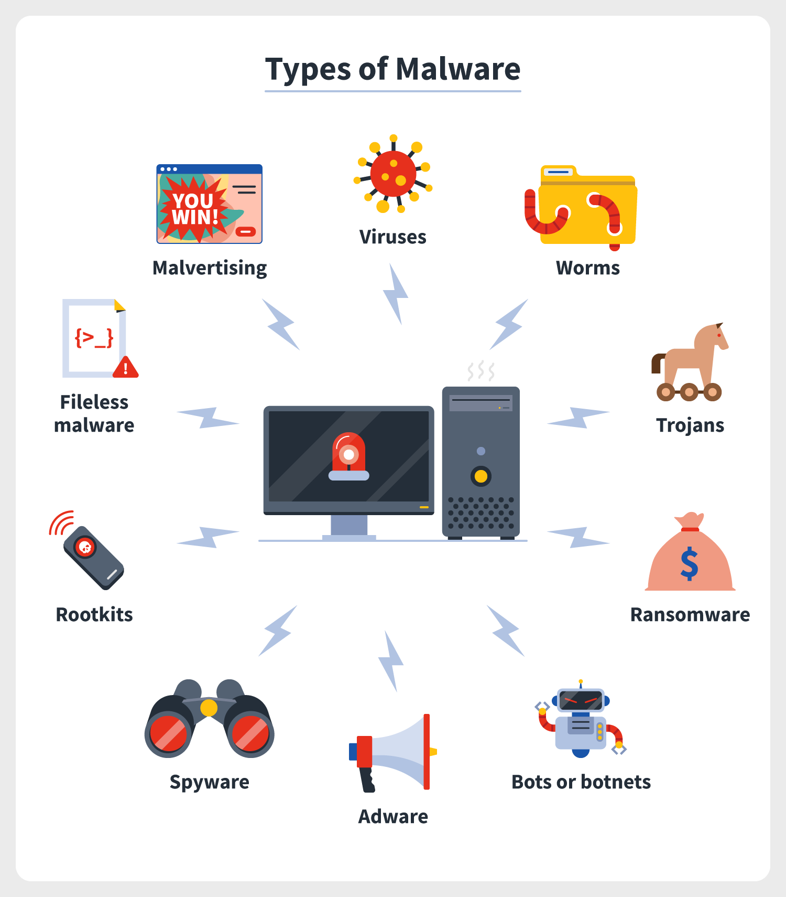
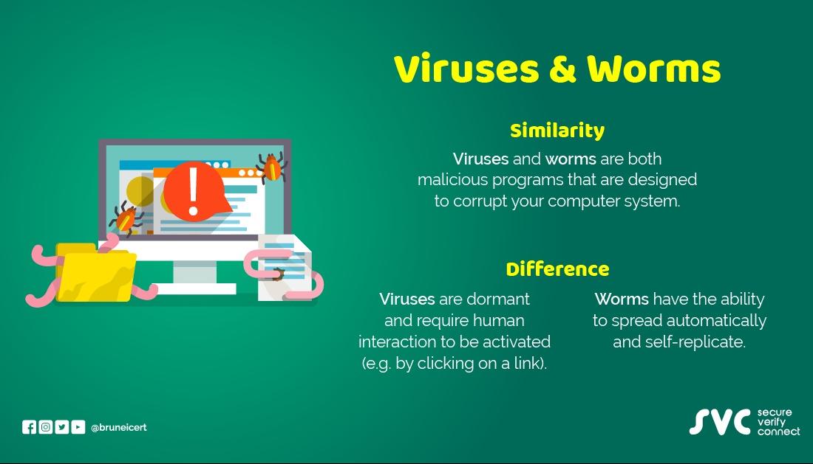

# Understanding Malware

> Outline:

- [x] **Comparing Malicious Programs**
- [x] **Explaining Viruses and Worms**
- [x] **Eliminating Unwanted Surveillance**
- [x] **Holding Data Hostage**
- [x] **Defending the OS**

---

## Content

### Comparing Malicious Programs 🦠

- **What is Malware?** 🦠

  - Malicious software designed to alter the integrity of a system, disrupt operations, or gain unauthorized access.

- **Types of Malware**:

  - **Ransomware**: Encrypts data and demands a ransom for decryption. 💰
  - **Virus**: Self-replicates and causes damage by infecting other programs or files. 🦠
  - **Worm**: Self-propagating malware that spreads independently across networks. 🌐
  - **Spyware**: Monitors and collects user activity without consent. 👀

- **Bots and Botnets**:

  - **Bot**: Malware that performs specific tasks, often used for automated actions. 🤖
  - **Botnet**: A network of compromised devices controlled by a single entity to conduct attacks. 🕹️

- **Rootkit**:
  - A set of tools designed to gain unauthorized access and control over a system while remaining undetected. 🕵️‍♂️

> More

### Explaining Viruses and Worms 🦠

- **Viruses**:

  - Malware that attaches to files or programs and replicates when those files are executed. It can cause various issues from minor annoyances to severe system damage. 🖥️

- **Worms**:

  - A type of virus that spreads independently across networks and systems without needing a host file. 🌐

- **How Viruses Spread**:

  - **Email Attachments**: Often spread through infected email attachments. 📧
  - **Internet Downloads**: Includes files and applications downloaded from untrusted sources. 🌐
  - **Removable Media**: Spread via flash drives or other removable storage. 💽

- **Effects of Computer Worms**:

  - Consume system resources and spread rapidly, potentially causing system slowdowns or crashes. 🛑

- **Best Ways to Protect from Malware**:
  - **Caution with Attachments**: Avoid opening suspicious email attachments. 🚫
  - **Antimalware Protection**: Use up-to-date antimalware software. 🛡️
  - **Avoid Risky Websites**: Stay away from dubious websites. 🌐
  - **Think Before Clicking**: Be careful with links and downloads. 🖱️

> More

### Eliminating Unwanted Surveillance 🕵️

- **What is Spyware or Adware?**:

  - **Spyware**: Malware that secretly monitors and collects user data. 🕵️
  - **Adware**: Software that displays unwanted advertisements. 📢

- **Types of Data Collected by Spyware**:

  - Keylogging data, browsing history, and personal information. 🔑

- **How Spyware Works**:

  - Monitors user activities and sends the collected data to remote servers. 📈

- **How to Stop Spyware**:
  - **Upgrade OS**: Keep your operating system updated. 🔄
  - **Use Antimalware**: Employ antimalware with spyware protection. 🛡️
  - **Update Browser**: Regularly update your web browser to fix vulnerabilities. 🌐

### Holding Data Hostage 🖥️🔒

- **What is Ransomware?**:

  - A type of malware that encrypts data and demands a ransom for decryption. 💰

- **How Ransomware Spreads**:

  - Through phishing emails, malicious links, and exploit kits. 📧

- **Consequences of Ransomware**:

  - **System Lock**: Blocks access to the system or data. 🚫
  - **File Encryption**: Encrypts files so they cannot be accessed. 🔐
  - **Application Disruption**: Stops applications like browsers or databases. 🛠️
  - **File Destruction**: Deletes files, causing permanent data loss. 💥

- **How Ransomware Works**:

  - **Phase 1: Bait**: Delivers the ransomware through deceptive methods. 🎣
  - **Phase 2: Encrypt**: Encrypts the victim's files. 🔒
  - **Phase 3: Contact**: Provides instructions to pay the ransom. 💬
  - **Phase 4: Wait**: Waits for the victim to pay. ⏳

- **How to Protect Yourself from Ransomware**:
  - **Be Cautious**: Avoid clicking on suspicious links. ⚠️
  - **Use Strong Spam Filters**: Prevent malicious emails from reaching you. 📧
  - **Employ Antimalware Protection**: Keep your antimalware software updated. 🛡️
  - **Back Up Data**: Regularly back up and securely store important files. 💾

### Defending the OS 🛡️

- **What is Securing the OS?**:
  - Implementing measures to protect the operating system from threats and vulnerabilities. 🔒

> **Tools That Protect the OS**

- **How macOS Protects Itself**:

  - **Notarization and XProtect**: Scans and monitors for malware, provides daily updates. 🛡️
  - **System Integrity Protection**: Blocks unauthorized access to critical system files. 🔐

- **How Linux Protects Itself**:

  - **SELinux**: Enforces security policies to restrict access. 🔐
  - **AppArmor**: Provides application-level protection by defining security profiles. 🛡️

- **How Windows Protects Itself**:
  - **Microsoft Defender**: Provides real-time protection against malware. 🛡️
  - **Data Execution Prevention (DEP)**: Prevents malware from executing code in system memory. 🛡️
  - **Microsoft Safety Scanner**: Scans for and removes malware threats. 🦠

---
