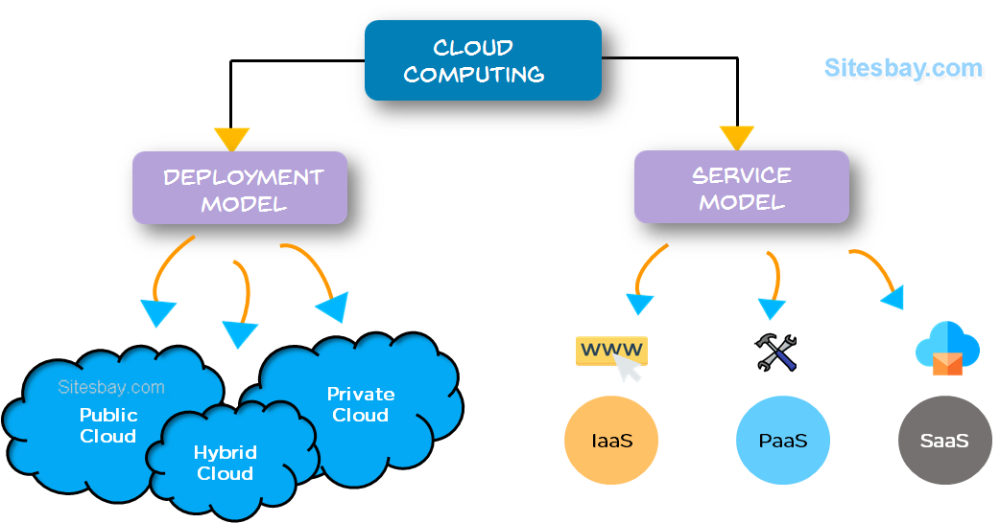

# Investigating Internet Security

## Table of Contents

1. [Accessing Cloud Resources ☁️](#accessing-cloud-resources)

   - [What is Cloud Computing? 🌐](#what-is-cloud-computing)
   - [Common Cloud Services 📂](#common-cloud-services)
   - [Cloud Service Visuals 📊](#cloud-service-visuals)

2. [Types of Cloud Services 🔐](#types-of-cloud-services)

   - [Using a Secure Connection 🔒](#using-a-secure-connection)
   - [Encrypting the Conversation 🔑](#encrypting-the-conversation)
   - [Protecting Yourself on the Internet 🛡️](#protecting-yourself-on-the-internet)

3. [Accepting Cookies 🍪](#accepting-cookies)

   - [What are Cookies? 🗂️](#what-are-cookies)
   - [What is HTTP? 🌐](#what-is-http)
   - [How Cookies Are Used 💻](#how-cookies-are-used)
   - [How to Defend Against Cookies 🛡️](#how-to-defend-against-cookies)

4. [Blocking Malicious Content 🚫](#blocking-malicious-content)

   - [Blocking Malicious Content 🔍](#blocking-malicious-content)
   - [What is a Web Browser? 🌐](#what-is-a-web-browser)
   - [Drive-By Downloads & Mining 🛠️](#drive-by-downloads--mining)
   - [Add-Ons and Security Risks ⚠️](#add-ons-and-security-risks)
   - [Providing Another Layer of Security 🔒](#providing-another-layer-of-security)

5. [Ensuring Browser Privacy 🔒](#ensuring-browser-privacy)
   - [What is a Private Browser? 🕵️‍♂️](#what-is-a-private-browser)
   - [Compromising Privacy 📉](#compromising-privacy)
   - [Improving Browser Privacy 🔧](#improving-browser-privacy)
   - [Configuring Additional Security ⚙️](#configuring-additional-security)

---

## Content

### Accessing Cloud Resources ☁️

#### What is Cloud Computing? 🌐

- **Definition:** Cloud computing involves obtaining resources from a provider over the internet, allowing access to data and services from anywhere in the world.
- **Main Types of Cloud Services:**
  - **Infrastructure as a Service (IaaS):** Provides virtualized computing resources over the internet.
  - **Platform as a Service (PaaS):** Offers hardware and software tools over the internet, usually for application development.

#### Common Cloud Services 📂

- **iCloud:** Storage and backup of all your data.
- **Google Drive:** Storage and productivity tools.
- **Dropbox:** Storage and collaboration.

#### Cloud Service Visuals 📊

  

### Types of Cloud Services 🔐

#### Using a Secure Connection 🔒

- **Definition:** A secure connection is indicated by a URL starting with `HTTPS` and a lock icon in the address bar. It ensures that any information exchanged between you and the website is protected.

#### Encrypting the Conversation 🔑

- **Definition:** Encryption involves exchanging a **shared key** between both sides to encrypt and decrypt data. If intercepted, the message remains unreadable without the shared key.

#### Protecting Yourself on the Internet 🛡️

- Ensure you see **HTTPS** in the address bar.
- Verify contact information and check for a privacy policy.
- Use a trusted browser and keep it updated.

### Accepting Cookies 🍪

#### What are Cookies? 🗂️

- **Definition:** Cookies are small text files that store information to make browsing easier by preserving user information, such as login details and preferences.

#### What is HTTP? 🌐

- **Definition:** HTTP (HyperText Transfer Protocol) is the protocol used to request and retrieve webpages. It does not store information about past visits, unlike HTTPS.

#### How Cookies Are Used 💻

- **Usage:** Cookies can store items in a shopping cart, browsing activity for recommendations, or marketing and advertising information.

#### How to Defend Against Cookies 🛡️

- **Safe Cookie Settings:** Select options that delete cookies upon exit to prevent advertisers from tracking you.
- **Third-Party Cookies:** Avoid allowing third-party cookies to enhance privacy.

### Blocking Malicious Content 🚫

#### Blocking Malicious Content 🔍

- **Definition:** Browsers have security settings to block or allow content from specific sites to protect against malicious activities.

#### What is a Web Browser? 🌐

- **Definition:** A web browser is software used to access and navigate the internet.

#### Drive-By Downloads & Mining 🛠️

- **Drive-By Download:** Installing malicious software simply by clicking on a malicious link or control.
- **Drive-By Mining:** Installs crypto-mining software on your device to mine cryptocurrencies and send the results to attackers.

#### Add-Ons and Security Risks ⚠️

- **Definition:** Add-ons can pose security risks if they are malicious or have vulnerabilities. Always use trusted add-ons and review permissions.

#### Providing Another Layer of Security 🔒

- **Definition:** Additional security layers can include using security plugins or extensions to enhance your browser's protection.

### Ensuring Browser Privacy 🔒

#### What is a Private Browser? 🕵️‍♂️

- **Definition:** A private browser limits exposure of your search history, reduces web tracking, and may conceal your location or IP address.

#### Compromising Privacy 📉

- **Compromises:**
  - Tracking behavior
  - Monitoring search history
  - Recording visited sites
  - Communicating search history

#### Improving Browser Privacy 🔧

- **Measures:**
  - Restrict risky add-ons
  - Actively block trackers
  - Use blocklists for phishing and malware sites
  - Utilize built-in security features

#### Configuring Additional Security ⚙️

- **Suggestions:**
  - Avoid using browser features that compromise privacy.
  - Disable built-in location services.
  - Set the browser to clear history and cookies on exit.
  - Use InPrivate or Incognito browsing modes.

---
