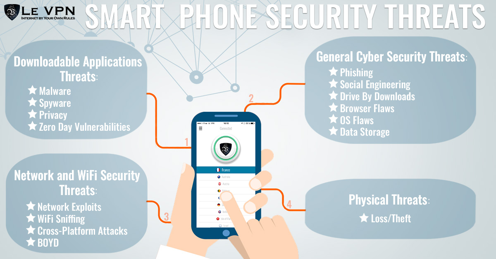

# Mobile and Wireless Security

---

## Table of Contents

1. [Securing Your Wi-Fi 📶](#securing-your-wi-fi)

   - [What is Wi-Fi? 🌐](#what-is-wi-fi)
   - [What is LAN? 🖧](#what-is-lan)
   - [Security Concerns ⚠️](#security-concerns)

2. [Securing Your Wi-Fi Connections 🔐](#securing-your-wi-fi-connections)

   - [What is a Pre-Shared Key? 🔑](#what-is-a-pre-shared-key)
   - [Defending Secure Wireless Communications 🛡️](#defending-secure-wireless-communications)

3. [Concealing Your Access Point 🔍](#concealing-your-access-point)

   - [What is a Wireless Access Point (AP)? 📡](#what-is-a-wireless-access-point-ap)
   - [Disabling SSID Broadcasting 🚫](#disabling-ssid-broadcasting)
   - [Using MAC Address Filtering 🛡️](#using-mac-address-filtering)

4. [Protecting Mobile Devices 📱](#protecting-mobile-devices)

   - [What is a Mobile Device? 📲](#what-is-a-mobile-device)
   - [Threats to Mobile Device Security ⚠️](#threats-to-mobile-device-security)
   - [How to Defend Mobile Devices 🔒](#how-to-defend-mobile-devices)
   - [Using Caution When Downloading Apps 📥](#using-caution-when-downloading-apps)
   - [Limiting Exposure of Your Mobile Number 📵](#limiting-exposure-of-your-mobile-number)

5. [Understanding UPnP 🔄](#understanding-upnp)
   - [What is UPnP? 🤖](#what-is-upnp)
   - [Security Risks ⚠️](#security-risks)

---

## Content

### Securing Your Wi-Fi 📶

#### What is Wi-Fi? 🌐

- **Definition:** Wi-Fi networks transmit signals using radio waves, which can be vulnerable to attacks. To secure your Wi-Fi, follow these simple steps:
  - Change default passwords
  - Disable remote access if not needed
  - Enable encryption

#### What is LAN? 🖧

- **Definition:** Local Area Network (LAN) is a network that connects computers within a limited area, like a home or office, using wired or wireless connections.

#### Security Concerns ⚠️

- **Common Issues:**
  - Not changing default passwords.
  - Allowing remote access without proper security.
  - Using inactive or outdated encryption methods.

### Securing Your Wi-Fi Connections 🔐

#### What is a Pre-Shared Key? 🔑

- **Definition:** A pre-shared key (PSK) is a shared secret used to encrypt and secure the traffic between devices on a Wi-Fi network. All authorized devices use this key to communicate securely.

#### Defending Secure Wireless Communications 🛡️

- **Methods:**
  - **Use Encryption:** Ensure encryption methods like WPA2 or WPA3 are enabled.
  - **WPA3:** The latest security protocol providing improved protection over WPA2.

### Concealing Your Access Point 🔍

#### What is a Wireless Access Point (AP)? 📡

- **Definition:** A Wireless Access Point (AP) connects client devices to a network and acts as a bridge between the devices and the network.

#### Disabling SSID Broadcasting 🚫

- **Definition:** SSID (Service Set Identifier) broadcasting allows devices to see and connect to your network. Disabling SSID broadcasting makes your network less visible to unauthorized users.

#### Using MAC Address Filtering 🛡️

- **Definition:** MAC (Media Access Control) address filtering allows you to specify which devices can connect to your network based on their MAC addresses. Only devices with approved MAC addresses can access the network.

### Protecting Mobile Devices 📱

#### What is a Mobile Device? 📲

- **Definition:** A mobile device is a portable computing device such as a smartphone or tablet that can connect to the internet and other networks.

#### Threats to Mobile Device Security ⚠️

- **Common Threats:**
  - **Phishing:** Fraudulent attempts to obtain sensitive information.
  - **Vishing:** Voice phishing conducted over phone calls.
  - **Spoofing:** Pretending to be a trusted entity to gain access to personal information.
  - **Spyware:** Malicious software designed to gather information without consent.
  - **Unsecured Wi-Fi:** Connecting to unsecured Wi-Fi networks can expose your device to attacks.

#### How to Defend Mobile Devices 🔒

- **Protection Tips:**
  - **Keep Software Updated:** Regular updates patch security vulnerabilities.
  - **Avoid Jailbreaking:** Jailbreaking removes built-in security features.
  - **Use Passwords:** Protect your device with a strong password.
  - **Set Idle Time-Out:** Automatically lock your phone when not in use.
  - **Stay Informed:** Keep up with recent threats and security news.

> More

#### Using Caution When Downloading Apps 📥

- **Advice:** Download apps only from trusted sources and review permissions before installing them.

#### Limiting Exposure of Your Mobile Number 📵

- **Advice:** Avoid sharing your mobile number publicly and be cautious of requests for personal information.

### Understanding UPnP 🔄

#### What is UPnP? 🤖

- **Definition:** Universal Plug and Play (UPnP) is a protocol designed to facilitate the discovery and connectivity of devices on a network. It allows devices to find and communicate with each other automatically. While convenient, UPnP can be a security vulnerability if not properly managed.

#### Security Risks ⚠️

- **Potential Issues:**
  - **Automatic Exposure:** UPnP can expose your network to external threats if devices automatically open ports without user intervention.
  - **Misconfigured Devices:** Devices using UPnP may create security holes if not properly configured, potentially allowing unauthorized access to your network.

To mitigate these risks:

- **Disable UPnP:** If not needed, disable UPnP on your router.
- **Use Secure Configurations:** Ensure devices using UPnP are properly secured and monitored.
- **Regular Updates:** Keep your router and network devices updated to protect against known vulnerabilities.
