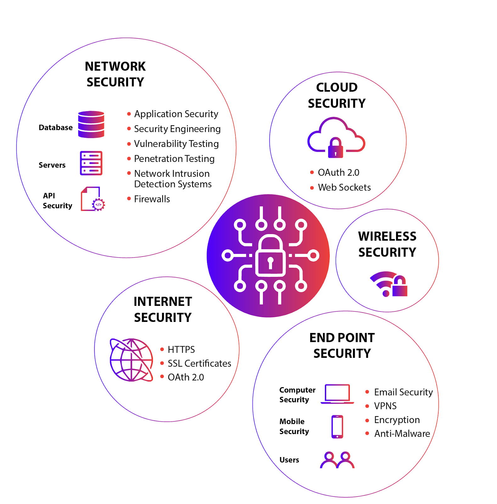

# Secure Devices and Applications 🔒

## Overview

The "Secure Devices and Applications" section focuses on strategies and techniques for protecting sensitive data and ensuring the integrity and confidentiality of information. This includes understanding encryption methods, hashing, and cryptographic techniques to safeguard data, as well as securing email communications against various threats.

## Table of Contents

- [x] **Providing Data Confidentiality** 🔐
- [x] **Ensuring Data Integrity** 🛡️
- [x] **Using Cryptographic Techniques** 🔑
- [x] **Securing Email** 📧

## Content

### Providing Data Confidentiality 🔐

**What does "Providing Data Confidentiality" mean?**

Providing **data confidentiality** means ensuring that sensitive information is accessible only to **authorized users**. This is achieved through **encryption**, which transforms data into a format that is unreadable without the proper **decryption key**.

**What is a Cipher?**

A **cipher** is a **code** or **algorithm** that uses a **secret key** to conceal data, making it unreadable to anyone who does not possess the key.

**What is Encryption?**

**Encryption** is the process of converting readable data (**plaintext**) into an unreadable format (**ciphertext**) using an **algorithm** and a **key**, ensuring that only authorized users can access the original data.

**What is Decryption?**

**Decryption** is the reverse process of encryption, where **ciphertext** is converted back into **plaintext** using a key, allowing authorized users to read the original data.

**What is Symmetric Encryption and When is it Used?**

**Symmetric encryption** uses the **same key** for both encryption and decryption. It is used when both the **sender** and **receiver** can securely share the same key.

**What is Asymmetric Encryption and When is it Used?**

**Asymmetric encryption** uses a pair of keys: a **public key** for encryption and a **private key** for decryption. It is used when secure key distribution is needed, as the private key is kept **secret** while the public key is shared.

### Ensuring Data Integrity 🛡️

**What is a Hash?**

A **hash** is a **one-way function** that converts data into a fixed-size string of characters, typically a **hash code**. It ensures that data has not been altered by generating a unique hash value for the original data.

**How Does Hashing Work?**

**Hashing** transforms input data into a unique hash value through a **mathematical function**. Any change in the input data will result in a different hash value, helping to detect data modifications.

**Compare Encryption vs. Hashing**

| Feature           | **Encryption**                    | **Hashing**                              |
| ----------------- | --------------------------------- | ---------------------------------------- |
| **Purpose**       | To conceal data using a key       | To verify data integrity                 |
| **Reversibility** | Reversible (can be decrypted)     | Non-reversible (one-way function)        |
| **Key Usage**     | Uses encryption keys              | No keys involved                         |
| **Use Case**      | Securing data during transmission | Ensuring data integrity and verification |

**Describe the SHA Family**

The **SHA (Secure Hash Algorithm)** family includes various hash functions such as **SHA-1**, **SHA-256**, and **SHA-3**, each producing different lengths of hash values and offering varying levels of **security**.

### Using Cryptographic Techniques 🔑

**What Does "Securing Data" Mean?**

**Securing data** involves protecting information through **cryptographic techniques** such as **encryption** and **hashing** to prevent unauthorized access and modifications.

**What Are Security Services?**

**Security services** include:

- **Confidentiality:** Protecting data from unauthorized access.
- **Integrity:** Ensuring data has not been altered.
- **Authentication:** Verifying the identity of users or systems.
- **Accountability:** Tracking and logging user actions for audit purposes.

**What is VPN?**

A **VPN (Virtual Private Network)** creates a **secure**, **encrypted connection** over a less secure network, such as the internet, to ensure **data privacy** and **integrity**.

**What is Blockchain?**

**Blockchain** is a decentralized **digital ledger** that records transactions across multiple computers, ensuring that records cannot be altered retroactively without changing all subsequent blocks.

**How to Secure Email?**

**Securing email** involves using encryption protocols like **S/MIME** (**Secure/Multipurpose Internet Mail Extensions**) to protect email content from unauthorized access.

### Securing Email 📧

**What Does "Securing Email" Mean?**

**Securing email** involves protecting email communications from unauthorized access and attacks, ensuring that sensitive information remains **confidential**.

**What Are Mail Attacks?**

**Mail attacks** include:

- **Spam:** Unsolicited and often irrelevant or inappropriate messages.
- **Spoofing:** Faking the sender's address to deceive recipients.
- **Phishing:** Attempting to acquire sensitive information by pretending to be a trustworthy entity.
- **Malware:** Malicious software delivered via email attachments or links.

**What Are Phishing Attacks?**

**Phishing attacks** are attempts to trick individuals into providing **sensitive information**, such as **passwords** or **financial details**, by pretending to be a legitimate entity.

**How to Defend Against Email Threats?**

- **Think Before Opening Links or Attachments:** Avoid clicking on suspicious links or downloading attachments from unknown sources.
- **Use Antimalware Protection:** Install and regularly update **antimalware software** to detect and remove threats.
- **Keep Your Browser Updated:** Ensure your **browser** is up-to-date to protect against vulnerabilities and check for forgery.

---
